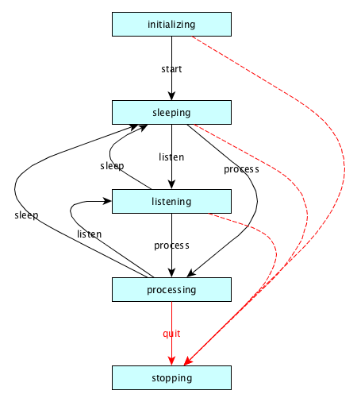

About Veebo
-----------

Veebo is a Voice Enhanced Electronic Bot Framework, written in python.

Veebo is modular. You can write plugin to extend the functionality provided by core frameowrk.

Veebo uses state_machine to let plugins know its current state and interact with it.

